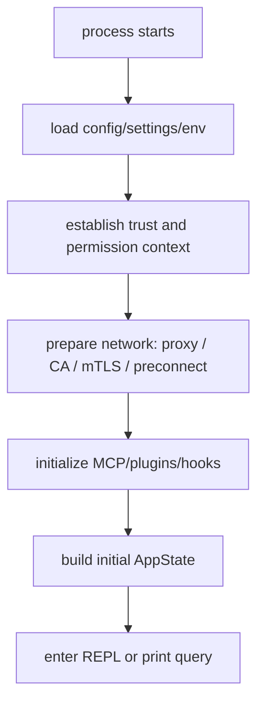

# 第 3 章：初始化系统与配置加载

## 本章定位

第 3 章继续沿着第 2 章的 `main.tsx -> preAction -> init()` 证据链往下走。第 2 章回答的是“CLI 入口如何分流”，本章回答的是：在进入 `runHeadless` 或 `launchRepl` 之前，系统必须先准备好哪些运行时基础设施。

对高级前端工程师来说，`entrypoints/init.ts` 可以类比为一个高风险的 app bootstrap 层，但它比普通 Web 前端 bootstrap 更敏感。因为 Claude Code 后续会做这些事：

- 发起模型 API 请求
- 读取用户、项目、企业策略配置
- 连接代理、mTLS、远程 managed settings
- 执行 hooks、工具、子进程
- 进入 REPL 或 headless runtime
- 在退出时 flush 日志、关闭 LSP、清理 session 级资源

因此初始化不是“杂项准备代码”，而是 AI CLI 主链路中的信任边界、网络边界、配置边界和清理边界。

本章保持 `SYSTEMATIC_COURSE.md` 第 3 章的主题不变，覆盖这些知识点：

1. `init()` 使用 memoize 避免重复初始化
2. 配置系统启用
3. safe env 与 full env 的区别
4. graceful shutdown
5. remote managed settings
6. policy limits
7. 网络、代理、证书、mTLS 初始化

它承接第 2 章的 `preAction`，并为第 4 章 React + Ink 终端 UI 准备一个已经完成基础配置、安全环境和网络能力的运行时。

## 面向高级前端工程师的学习价值

本章不讲“什么是初始化函数”。你要关注的是大型 AI CLI 初始化和普通前端初始化的差异：

| 普通前端应用 bootstrap | Claude Code 初始化 |
| --- | --- |
| 加载 env、创建 root、挂载 App | 加载 env、策略、代理、证书、远程配置、shutdown、telemetry |
| 配置错误通常显示 error boundary | 配置错误可能要分 interactive/headless 两种输出路径 |
| 网络请求通常在业务层发起 | API preconnect、proxy、mTLS 必须在 query 前准备好 |
| 权限多是 UI 状态 | env 和 project settings 涉及 trust boundary |
| cleanup 多是组件卸载 | CLI 退出时要 flush 日志、关闭 LSP、清理 session 资源 |

本章最大的价值是建立一个判断：初始化代码不是线性“准备事项清单”，而是在多个边界之间做取舍：

- 哪些必须阻塞？
- 哪些可以 fire-and-forget？
- 哪些必须在 trust dialog 前执行？
- 哪些必须等 trust 后再执行？
- 哪些要提供 wait promise 给后续系统？
- 哪些失败应该 fail open，哪些失败必须中断？

这些问题会贯穿后续 REPL、query、tool、permission、MCP 的阅读。

## 学习目标

完成本章后，你应该能够：

1. 用源码证明 `init()` 是 memoized，并解释为什么入口和子命令需要 idempotent 初始化。
2. 追踪 `preAction -> init -> enableConfigs -> applySafeConfigEnvironmentVariables` 的配置启动链路。
3. 区分 `applySafeConfigEnvironmentVariables()` 和 `applyConfigEnvironmentVariables()` 的信任边界。
4. 找到 graceful shutdown 的注册点，并说明它为什么要早于 REPL/query。
5. 解释 remote managed settings 和 policy limits 为什么要先初始化 loading promise，再由 `main.tsx` 后续 load。
6. 追踪 CA、mTLS、proxy、API preconnect 的顺序，并说明顺序为什么影响首个模型请求。
7. 在 `learning-framework` 中复刻一个简化 `init()`：配置启用、安全 env、shutdown cleanup、非阻塞预加载、错误路径。

## 前置知识

本章默认你已经理解：

- 第 2 章的 `program.hook('preAction')`
- CLI 有 interactive 和 headless 两条 runtime
- 配置、环境变量和网络代理会影响后续 API 请求
- 大型应用 bootstrap 中 blocking task 与 background task 的差异

本章不会重复讲：

- TypeScript import/export
- Promise 基础
- React app mount
- Commander 语法
- OpenTelemetry 基础

如果你不熟悉企业策略、mTLS 或 managed settings，不影响阅读。先按源码链路理解它们在初始化中的位置即可。

## 核心概念讲解

### 1. `init()` 为什么使用 memoize

源码锚点：

```bash
rg -n "export const init|memoize" claudecode-project/src/entrypoints/init.ts
```

`init` 被定义成 memoized async function。它存在的工程问题是：CLI 入口和多个子命令可能都会需要基础环境，但初始化不能重复注册 shutdown handler、重复启动 telemetry、重复配置网络 agent 或重复创建远程 loading promise。

在主链路中的位置：

```text
main.tsx
  -> program.hook('preAction')
  -> await init()
  -> main action / subcommand action
```

它和后续模块的关系：

- REPL 依赖已经启用的配置系统和 env。
- query 依赖网络代理、证书、API preconnect、telemetry。
- tool/hook/subprocess 依赖 env 和 cleanup registry。
- print/headless 依赖配置错误能走 stderr/exit，而不是 Ink dialog。

### 2. 配置系统启用不是读取一个 JSON 那么简单

源码锚点：

```bash
rg -n "enableConfigs|getSettingsForSource|getSettings_DEPRECATED|ConfigParseError" claudecode-project/src/utils claudecode-project/src/entrypoints/init.ts -g '*.{ts,js}'
```

`enableConfigs()` 在 `init()` 早期执行。它的目标不是“拿到某个配置对象”，而是打开后续所有配置读取能力，让 settings、policy、remote settings、CLI flags 能按预期参与合并。

配置错误在 `init()` 中有专门处理：

```text
ConfigParseError
  -> headless: stderr + gracefulShutdownSync(1)
  -> interactive: dynamic import InvalidConfigDialog
```

这说明配置错误输出也要尊重 runtime：headless 不能弹 Ink dialog，interactive 可以走 UI。

### 3. safe env 和 full env 是 trust boundary

源码锚点：

```bash
rg -n "applySafeConfigEnvironmentVariables|applyConfigEnvironmentVariables|SAFE_ENV_VARS|TRUSTED_SETTING_SOURCES" claudecode-project/src/utils/managedEnv.ts
```

`applySafeConfigEnvironmentVariables()` 在 `init()` 里执行，发生在 trust dialog 之前。它只允许安全范围内的 project/local env 生效，同时允许 trusted sources 的 env 生效。

`applyConfigEnvironmentVariables()` 是 trust 后调用，允许完整 settings env 写入 `process.env`，并清理 CA/mTLS/proxy cache、重新配置 global agents。

主链路位置：

```text
init()
  -> applySafeConfigEnvironmentVariables()
  -> applyExtraCACertsFromConfig()
  -> configureGlobalMTLS()
  -> configureGlobalAgents()

trust accepted / print considered trusted
  -> applyConfigEnvironmentVariables()
  -> initializeTelemetryAfterTrust()
```

设计意图：

- project settings 是仓库可控的，不能在用户信任前应用危险 env。
- API base URL、proxy、PATH、LD_PRELOAD 这类 env 会影响进程行为，必须有信任边界。
- 但某些用户/企业级 env 又必须早于首次 API 或 onboarding 生效。

### 4. graceful shutdown 是 CLI 的全局退出协议

源码锚点：

```bash
rg -n "setupGracefulShutdown|gracefulShutdownSync|registerCleanup" claudecode-project/src/entrypoints/init.ts claudecode-project/src/utils/gracefulShutdown.ts claudecode-project/src/utils/cleanupRegistry.ts
```

`setupGracefulShutdown()` 在 safe env 之后、异步后台任务之前执行。它要尽早建立退出协议，因为后面会启动日志、LSP、MCP、hooks、background tasks、team cleanup 等资源。

本章重点不是读每个 cleanup 实现，而是理解边界：

```text
init()
  -> setupGracefulShutdown()
  -> registerCleanup(shutdownLspServerManager)
  -> registerCleanup(cleanupSessionTeams)
  -> later runtime registers more cleanup
  -> process exit / error / ctrl-c
  -> graceful shutdown runs cleanup
```

对 CLI 产品来说，退出不是页面卸载。退出时如果不集中处理，可能导致日志丢失、server 未关闭、团队/agent 临时资源残留。

### 5. remote managed settings 和 policy limits 使用 early promise

源码锚点：

```bash
rg -n "initializeRemoteManagedSettingsLoadingPromise|isEligibleForRemoteManagedSettings|waitForRemoteManagedSettingsToLoad|loadRemoteManagedSettings" claudecode-project/src/services/remoteManagedSettings/index.ts claudecode-project/src/entrypoints/init.ts claudecode-project/src/main.tsx
rg -n "initializePolicyLimitsLoadingPromise|isPolicyLimitsEligible|loadPolicyLimits" claudecode-project/src/services/policyLimits/index.ts claudecode-project/src/entrypoints/init.ts claudecode-project/src/main.tsx
```

`init()` 只初始化 loading promise，不直接完成所有远程加载。第 2 章里 `preAction` 在 `init()` 后会 `void loadRemoteManagedSettings()` 和 `void loadPolicyLimits()`。

主链路：

```text
init()
  -> if eligible initializeRemoteManagedSettingsLoadingPromise()
  -> if eligible initializePolicyLimitsLoadingPromise()

main.tsx preAction after init
  -> void loadRemoteManagedSettings()
  -> void loadPolicyLimits()

later systems
  -> waitForRemoteManagedSettingsToLoad()
  -> read policy/limits when needed
```

为什么这样设计：

- 有些系统需要“可以等待远程配置”的句柄。
- 但远程配置不能无限阻塞启动，所以 promise 内置 timeout。
- 加载本身可以 fail open，避免企业策略服务短暂不可用导致 CLI 完全不可用。
- headless/SDK 测试不一定走完整 main 流程，所以 wait promise 需要防死锁。

### 6. 网络、证书、mTLS、proxy 必须早于首个 API 请求

源码锚点：

```bash
rg -n "applyExtraCACertsFromConfig|configureGlobalMTLS|configureGlobalAgents|preconnectAnthropicApi" claudecode-project/src/entrypoints/init.ts claudecode-project/src/utils -g '*.{ts,js}'
```

顺序很重要：

```text
applySafeConfigEnvironmentVariables()
  -> applyExtraCACertsFromConfig()
  -> configureGlobalMTLS()
  -> configureGlobalAgents()
  -> preconnectAnthropicApi()
```

设计意图：

- CA certs 要在首次 TLS 前应用。
- mTLS 和 proxy 要在 API preconnect 前配置。
- preconnect 尝试把 TCP/TLS 握手和 action handler 中的其他工作重叠。

这条链路会直接影响第 8 章 `query.ts` 的首次模型请求体验。

### 7. fire-and-forget 不是随便 `void`

`init.ts` 里有很多 `void something()`，例如 1P event logging、OAuth account info、JetBrains detection、repository detection、preconnect。高级读者容易把这些都归类为“后台杂项”，但更准确的分类是：

| 类型 | 是否阻塞 init | 原因 |
| --- | --- | --- |
| 配置启用 | 阻塞 | 后续读取配置依赖它 |
| safe env | 阻塞 | 后续网络和 eligibility 依赖它 |
| graceful shutdown | 阻塞 | 后续启动资源需要退出协议 |
| remote/policy loading promise | 阻塞创建 promise，不阻塞加载 | 后续系统需要 wait handle |
| OAuth/IDE/repo detection | 非阻塞 | 缓存优化，不影响主链路立即进入 |
| preconnect | 非阻塞 | 性能优化，失败不应中断 |
| upstream proxy remote path | 条件阻塞/捕获错误 | 远程模式下影响子进程网络 |

fire-and-forget 的关键不是“无所谓”，而是“当前阶段不等待，但要明确失败语义”。

## 核心源码地图

| 文件 | 本章看什么 | 本章不看什么 | 后续章节 |
| --- | --- | --- | --- |
| `claudecode-project/src/entrypoints/init.ts` | `init()` 顺序、错误路径、telemetry after trust | telemetry 具体实现、每个异步任务内部 | 第 8、14 章还会遇到 telemetry/startup profiling |
| `claudecode-project/src/main.tsx` | `preAction` 如何调用 `init()`，以及后续 load remote/policy | Commander option 细节，第 2 章已覆盖 | 第 5 章进入 REPL 分支 |
| `claudecode-project/src/utils/managedEnv.ts` | safe env/full env 的信任边界 | 每个 env allowlist 细节 | 第 11 章权限和安全边界会回看 |
| `claudecode-project/src/utils/config.ts` | `enableConfigs()`、first start、配置系统入口 | settings 合并算法的所有细节 | 第 6、11、13 章涉及 settings 变更 |
| `claudecode-project/src/services/remoteManagedSettings/index.ts` | early loading promise、eligibility、wait/load 分离 | 远程 API payload 和缓存全部细节 | 第 6、11、13 章涉及策略影响 |
| `claudecode-project/src/services/policyLimits/index.ts` | policy loading promise、eligibility、load | 具体限制项判断规则 | 第 10、11 章工具/权限会用到 |
| `claudecode-project/src/utils/gracefulShutdown.ts` | shutdown 注册和同步退出能力 | 每种 signal 的完整处理 | 第 14 章高级工程化 |
| `claudecode-project/src/utils/proxy.ts`、`mtls.ts`、`caCertsConfig.ts`、`apiPreconnect.ts` | 网络准备顺序 | 各平台代理实现细节 | 第 8 章 query 首次 API 请求 |

## 主调用链 / 主数据流

### 从 CLI 到 init

```text
main.tsx run()
  -> program.hook('preAction')
  -> await ensureMdmSettingsLoaded()
  -> await ensureKeychainPrefetchCompleted()
  -> await init()
  -> initSinks()
  -> runMigrations()
  -> void loadRemoteManagedSettings()
  -> void loadPolicyLimits()
  -> command/action continues
```

### init 内部主链路

```text
init()
  -> enableConfigs()
  -> applySafeConfigEnvironmentVariables()
  -> applyExtraCACertsFromConfig()
  -> setupGracefulShutdown()
  -> start non-blocking analytics/oauth/IDE/repo detection
  -> initialize remote/policy loading promises
  -> recordFirstStartTime()
  -> configureGlobalMTLS()
  -> configureGlobalAgents()
  -> preconnectAnthropicApi()
  -> optional upstream proxy
  -> setShellIfWindows()
  -> registerCleanup(...)
  -> ensureScratchpadDir if enabled
  -> return to main action
```

### trust 后环境变量与 telemetry

```text
interactive trust accepted or print trusted path
  -> applyConfigEnvironmentVariables()
  -> clear CA/mTLS/proxy caches
  -> configureGlobalAgents()
  -> initializeTelemetryAfterTrust()
       -> maybe waitForRemoteManagedSettingsToLoad()
       -> applyConfigEnvironmentVariables() again
       -> doInitializeTelemetry()
```

这条链路说明 env 不是“一次性加载”。安全 env、完整 env、远程策略 env、telemetry 初始化之间有明确阶段关系。

## 源码阅读路线

### 路线一：确认 `preAction -> init` 边界

阅读目标：确认第 2 章的 `preAction` 如何进入本章。

```bash
rg -n "program\\.hook\\('preAction'|await init\\(|loadRemoteManagedSettings\\(|loadPolicyLimits\\(" claudecode-project/src/main.tsx
```

应该看到的证据：

- `preAction` 内 await `init()`
- `init()` 后才 fire-and-forget load remote settings / policy limits

形成判断：

`init()` 是命令执行前基础环境准备，远程策略加载被拆成“创建可等待 promise”和“后续异步加载”两段。

### 路线二：拆 `init()` 的阻塞顺序

阅读目标：识别哪些任务必须按顺序完成。

```bash
rg -n "enableConfigs|applySafeConfigEnvironmentVariables|applyExtraCACertsFromConfig|setupGracefulShutdown|configureGlobalMTLS|configureGlobalAgents|preconnectAnthropicApi|registerCleanup" claudecode-project/src/entrypoints/init.ts
```

应该看到的证据：

- config/env/shutdown/network/cleanup 的顺序
- `preconnectAnthropicApi()` 在 proxy/mTLS 之后

形成判断：

初始化顺序不是随意排列，而是在信任边界、网络边界和退出边界之间排出来的。

### 路线三：验证 safe env 与 full env

阅读目标：确认 trust 前后环境变量应用不同。

```bash
rg -n "applySafeConfigEnvironmentVariables|applyConfigEnvironmentVariables|SAFE_ENV_VARS|TRUSTED_SETTING_SOURCES|clearCACertsCache|clearMTLSCache|clearProxyCache" claudecode-project/src/utils/managedEnv.ts
rg -n "applyConfigEnvironmentVariables\\(|initializeTelemetryAfterTrust" claudecode-project/src/main.tsx claudecode-project/src/entrypoints/init.ts
```

应该看到的证据：

- safe env 只允许部分 project/local env
- full env 会 clear caches 并 reconfigure global agents
- telemetry after trust 可能再次应用 env

形成判断：

env 加载是安全边界，不是普通配置读取。

### 路线四：追踪 remote settings / policy limits 的 wait handle

阅读目标：确认 early promise + later load 设计。

```bash
rg -n "initializeRemoteManagedSettingsLoadingPromise|waitForRemoteManagedSettingsToLoad|loadRemoteManagedSettings|LOADING_PROMISE_TIMEOUT_MS" claudecode-project/src/services/remoteManagedSettings/index.ts claudecode-project/src/entrypoints/init.ts claudecode-project/src/main.tsx
rg -n "initializePolicyLimitsLoadingPromise|loadPolicyLimits|LOADING_PROMISE_TIMEOUT_MS|isPolicyLimitsEligible" claudecode-project/src/services/policyLimits/index.ts claudecode-project/src/entrypoints/init.ts claudecode-project/src/main.tsx
```

应该看到的证据：

- promise 初始化在 `init()`
- load 在 `main.tsx preAction` 后续触发
- promise 有 timeout 防止死锁

形成判断：

远程策略不是强阻塞启动项，而是给后续系统一个可等待但不无限等待的同步点。

### 路线五：确认配置错误如何分 runtime 输出

阅读目标：确认 headless 和 interactive 配置错误路径不同。

```bash
rg -n "ConfigParseError|getIsNonInteractiveSession|showInvalidConfigDialog|gracefulShutdownSync" claudecode-project/src/entrypoints/init.ts
```

应该看到的证据：

- headless 走 stderr + exit
- interactive 动态 import InvalidConfigDialog

形成判断：

初始化层已经开始尊重 runtime 输出协议，这是第 4 章 UI 和 print runtime 的前置分流。

## 5 分钟源码速验

### 验证 1：`init` 是 memoized

```bash
rg -n "export const init = memoize" claudecode-project/src/entrypoints/init.ts
```

确认 `init()` 不是普通函数，重复调用会复用第一次执行结果。

### 验证 2：配置和 safe env 在最前面

```bash
rg -n "enableConfigs|applySafeConfigEnvironmentVariables|applyExtraCACertsFromConfig" claudecode-project/src/entrypoints/init.ts
```

确认配置启用和 safe env 发生在 shutdown、网络、preconnect 之前。

### 验证 3：完整 env 在 trust 后

```bash
rg -n "applyConfigEnvironmentVariables\\(|initializeTelemetryAfterTrust" claudecode-project/src/main.tsx claudecode-project/src/entrypoints/init.ts
```

确认 full env 不是 `init()` 开始就无条件应用。

### 验证 4：remote/policy loading promise

```bash
rg -n "initializeRemoteManagedSettingsLoadingPromise|initializePolicyLimitsLoadingPromise" claudecode-project/src/entrypoints/init.ts
rg -n "loadRemoteManagedSettings\\(|loadPolicyLimits\\(" claudecode-project/src/main.tsx
```

确认 promise 初始化和实际加载分属两个阶段。

### 验证 5：网络准备顺序

```bash
rg -n "configureGlobalMTLS|configureGlobalAgents|preconnectAnthropicApi" claudecode-project/src/entrypoints/init.ts
```

确认 preconnect 在 mTLS/proxy 配置之后。

### 验证 6：错误路径分 runtime

```bash
rg -n "ConfigParseError|getIsNonInteractiveSession|InvalidConfigDialog" claudecode-project/src/entrypoints/init.ts
```

确认配置错误在 headless 和 interactive 下不是同一种输出方式。

## 关键模块逐段导读

### 1. `init()` 开头：配置与安全 env

运行时职责：

```text
enableConfigs()
  -> applySafeConfigEnvironmentVariables()
  -> applyExtraCACertsFromConfig()
```

设计意图：

- 先让配置系统可用。
- 再应用 trust 前允许的 env。
- 再处理 CA cert，因为 TLS 相关配置必须早于网络连接。

上游来自第 2 章的 `preAction`，下游影响所有 API/MCP/query 网络请求。

### 2. shutdown 注册：为后续资源建立退出协议

运行时职责：

```text
setupGracefulShutdown()
  -> later registerCleanup(...)
```

设计意图：

- CLI 生命周期不受 React 组件树控制。
- 后续启动的 LSP、team cleanup、hooks、日志都需要退出协议。
- 配置错误也可能通过 `gracefulShutdownSync(1)` 退出。

这为第 5 章 REPL 和第 14 章后台任务/远程/Agent 清理铺垫。

### 3. 非阻塞预加载：提升体验但不阻塞主路径

运行时职责：

```text
void initialize1PEventLogging()
void populateOAuthAccountInfoIfNeeded()
void initJetBrainsDetection()
void detectCurrentRepository()
preconnectAnthropicApi()
```

设计意图：

- 这些任务有价值，但不应该阻塞首次交互。
- 有些任务只是缓存或遥测。
- preconnect 是性能优化，不能成为可靠性风险。

读源码时要区分“非阻塞”与“不重要”。非阻塞表示它不在当前 critical path。

### 4. remote/policy promise：给后续系统同步点

运行时职责：

```text
if eligible initialize loading promise
main preAction later starts load
other systems can wait
timeout prevents deadlock
```

设计意图：

- 企业策略可能影响 env、telemetry、工具、插件、权限。
- 但远程服务不能拖死启动。
- 所以使用 early wait handle + later async load。

这类设计在大型前端里也常见：先创建 resource handle，再由后台加载填充。

### 5. 网络层准备：影响首个 query

运行时职责：

```text
configureGlobalMTLS()
configureGlobalAgents()
preconnectAnthropicApi()
```

设计意图：

- 代理和 mTLS 决定请求怎么发。
- preconnect 要使用正确的 transport。
- 第 8 章 query 发出首个模型请求时，不能再临时发现网络环境没准备好。

### 6. 错误路径：runtime 输出协议从 init 开始分流

运行时职责：

```text
catch ConfigParseError
  -> headless: stderr + exit
  -> interactive: InvalidConfigDialog
```

设计意图：

- headless 的消费者可能是脚本或 SDK，需要机器友好的 stderr/exit。
- interactive 用户可以看到 Ink dialog。
- `init()` 不只是内部初始化，也要尊重外部运行协议。

## 与前后章节的关系

### 承接第 2 章

第 2 章定位了：

```text
main.tsx
  -> preAction
  -> await init()
```

本章展开 `init()` 内部做了什么，以及为什么这些动作必须早于 `runHeadless` 和 `launchRepl`。

### 连接第 4 章 Ink UI

第 4 章会进入 React + Ink。进入 UI 前，本章已经处理：

- 配置是否可读
- trust 前 env 是否安全应用
- 配置错误是否要显示 dialog
- shutdown 是否已经可用

也就是说，UI 不是裸启动，它建立在初始化后的 runtime 之上。

### 连接 REPL、AppState、Message、query、tool、permission、command、MCP

- REPL 依赖配置、env、cleanup、telemetry、remote settings 的基础状态。
- AppState 会在 settings change、permission context、MCP state 中继续消费初始化结果。
- Message/query 依赖网络代理、证书、preconnect、telemetry。
- tool/permission 依赖 policy limits、safe/full env、workspace trust。
- command/MCP/plugin 会受到 remote managed settings 和 policy limits 影响。

### 后续会继续使用的点

- 第 4 章：InvalidConfigDialog 和 Ink 渲染路径
- 第 5 章：REPL 启动前的 initialState 和 cleanup
- 第 8 章：query 首次 API 请求依赖网络初始化
- 第 11 章：safe env/full env 与权限边界
- 第 13 章：remote settings/policy 对插件和 MCP 的约束
- 第 14 章：graceful shutdown、startup profiling、preconnect、telemetry

## 深度补强：初始化顺序为什么不能随便调换

初始化系统要解决三个边界：信任边界、网络边界、退出边界。顺序不是为了代码整齐，而是为了保证第一轮 query 和第一批 tool 执行前，运行时处在可控状态。

| 初始化动作 | 必须早的原因 | 如果顺序错了 |
| --- | --- | --- |
| workspace trust / permission mode | 决定工具是否可执行、是否需要 ask | 模型可能先看到或调用不该暴露的工具 |
| settings / env / policy | 决定模型、代理、更新、安全策略 | API 请求或 tool subprocess 使用错误配置 |
| proxy / CA / mTLS / preconnect | 决定首个模型请求网络路径 | 首轮 query 慢、失败或绕过企业网络配置 |
| cleanup / shutdown hooks | 管理子进程、后台任务、日志 flush | 退出时残留进程或丢 telemetry/session |
| MCP/plugin discovery | 决定扩展工具和命令 | 首轮缺工具，后续工具池突然变化 |



这里的设计取舍是“启动慢一点也要边界正确”。例如 proxy 和 CA 配置如果晚于 API client 创建，后续 retry 可能也救不回来；permission context 如果晚于 tool pool 构造，模型可见工具就可能和真实可执行工具不一致。

本章读源码时要把 `init()` 当成一个有依赖关系的 DAG，而不是一串 await：

```text
config/env -> trust/permission -> network -> extensions -> AppState -> query/tool
```

类似顺序约束后面还会出现：第 8 章 query 先 compact 再 callModel，第 10 章 tool 先 partition 再执行，第 11 章 permission 先 check 再 call。

## 教学可视化表达方式

### 1. 初始化阶段图

```text
preAction
  -> init()
       ├─ config enabled
       ├─ safe env applied
       ├─ CA/proxy/mTLS prepared
       ├─ shutdown protocol installed
       ├─ remote/policy wait handles created
       ├─ non-blocking preloads started
       └─ cleanup handlers registered
  -> async load remote/policy
  -> action runtime
```

### 2. env 信任边界图

```text
Before trust
  -> applySafeConfigEnvironmentVariables()
       ├─ trusted sources: broader env
       └─ project/local: SAFE_ENV_VARS only

After trust or print trusted path
  -> applyConfigEnvironmentVariables()
       ├─ full settings env
       ├─ clear CA/mTLS/proxy caches
       └─ configureGlobalAgents()
```

### 3. remote/policy 双阶段图

```text
init()
  -> initializeRemoteManagedSettingsLoadingPromise()
  -> initializePolicyLimitsLoadingPromise()
        │
        ├─ gives wait handle to later systems
        │
main preAction after init
  -> void loadRemoteManagedSettings()
  -> void loadPolicyLimits()
        │
        └─ resolve or timeout, fail open where appropriate
```

### 4. 网络准备图

```text
safe env
  -> extra CA certs
  -> mTLS
  -> proxy/global agents
  -> API preconnect
  -> query first request
```

## 实践任务

### 任务 1：定位 `init()` 主骨架

使用：

```bash
rg -n "export const init|enableConfigs|applySafeConfigEnvironmentVariables|setupGracefulShutdown|configureGlobalMTLS|configureGlobalAgents|preconnectAnthropicApi|registerCleanup" claudecode-project/src/entrypoints/init.ts
```

产出格式：

```markdown
| 符号 | 行号 | 阻塞/非阻塞 | 运行时职责 |
| --- | --- | --- | --- |
| `enableConfigs` | ... | 阻塞 | 启用配置系统 |
```

### 任务 2：追踪 safe env/full env 生命周期

使用：

```bash
rg -n "applySafeConfigEnvironmentVariables|applyConfigEnvironmentVariables|SAFE_ENV_VARS|TRUSTED_SETTING_SOURCES" claudecode-project/src/utils/managedEnv.ts
rg -n "applyConfigEnvironmentVariables\\(" claudecode-project/src/main.tsx claudecode-project/src/entrypoints/init.ts
```

产出：

```markdown
## env trust boundary

1. trust 前入口：...
2. trust 后入口：...
3. safe env 限制：...
4. full env 副作用：...
5. 对 query/tool/permission 的影响：...
```

### 任务 3：画 remote settings 的真实证据链

使用：

```bash
rg -n "initializeRemoteManagedSettingsLoadingPromise|waitForRemoteManagedSettingsToLoad|loadRemoteManagedSettings" claudecode-project/src/services/remoteManagedSettings/index.ts claudecode-project/src/entrypoints/init.ts claudecode-project/src/main.tsx
```

产出一条带文件名/函数名的链路：

```text
init.ts
  -> initializeRemoteManagedSettingsLoadingPromise
main.tsx preAction
  -> loadRemoteManagedSettings
later
  -> waitForRemoteManagedSettingsToLoad
```

并解释为什么要有 timeout。

### 任务 4：分析配置错误的 runtime 输出

使用：

```bash
rg -n "ConfigParseError|getIsNonInteractiveSession|InvalidConfigDialog|gracefulShutdownSync" claudecode-project/src/entrypoints/init.ts
```

产出：

```markdown
| runtime | 错误输出方式 | 为什么 |
| --- | --- | --- |
| headless | stderr + exit | ... |
| interactive | Ink dialog | ... |
```

### 任务 5：在 learning-framework 复刻简化 `init()`

实现一个简化初始化模块，建议文件：

```text
learning-framework/src/entrypoints/init.ts
```

要求：

- `init()` 必须 idempotent，可以用 memoize 或手写 once promise。
- 支持 `enableConfig()`。
- 支持 `applySafeEnv()` 和 `applyFullEnv()` 两阶段。
- 支持 `registerCleanup()` 和 `gracefulShutdown()`。
- 启动一个非阻塞 preload，并记录日志。
- 模拟配置错误：interactive 返回 UI error 对象，headless 返回 exit code。

产出：

```markdown
## learning-framework init 复刻说明

1. 我实现了哪些阶段：...
2. 哪些是阻塞：...
3. 哪些是非阻塞：...
4. 和 Claude Code 原源码相比删掉了什么：...
```

### 任务 6：进阶分析题

任选一题，写 300-500 字：

1. 为什么 `applySafeConfigEnvironmentVariables()` 必须早于网络初始化，但 `applyConfigEnvironmentVariables()` 不能无条件早执行？
2. remote settings/policy limits 为什么使用 early promise，而不是在 `init()` 中直接 await load？
3. `preconnectAnthropicApi()` 是性能优化，为什么它仍然必须位于 proxy/mTLS 之后？
4. 对比 Web 前端和 AI CLI：为什么 CLI 的 graceful shutdown 比组件 unmount 更像全局协议？

## 常见误区

### 误区 1：把初始化当杂项清单

高级前端读 bootstrap 时容易快速扫过初始化代码。但这里的初始化定义了 trust boundary、network boundary、exit boundary。后续 tool/query/permission/MCP 都依赖这些边界。

### 误区 2：认为 `void someAsyncTask()` 就是不重要

非阻塞不等于不重要。它只表示不在当前 critical path。要看它是否有失败处理、是否 fail open、是否有后续 wait handle。

### 误区 3：把 env 当普通配置

在 AI CLI 里 env 可以改变 API endpoint、代理、证书、子进程行为和 provider routing。safe env/full env 的分离是安全设计，不是过度工程。

### 误区 4：忽略 headless 和 interactive 的错误输出差异

headless 面向脚本/SDK，interactive 面向人和 Ink UI。初始化层已经开始区分输出协议，不能假设所有错误都走同一种 UI。

### 误区 5：过早深入 remote settings 业务细节

本章只需要理解 remote settings/policy limits 在初始化链路中的同步模型。具体策略如何影响工具、插件、权限，后续章节再深入。

## 本章总结

本章建立的源码心智模型：

```text
preAction
  -> init()
       -> config enabled
       -> safe env
       -> shutdown
       -> remote/policy wait handles
       -> network transport
       -> cleanup registry
  -> async remote/policy load
  -> print or REPL runtime
```

最重要的证据链：

```text
main.tsx program.hook('preAction')
  -> await init()
  -> entrypoints/init.ts memoized init
  -> enableConfigs()
  -> applySafeConfigEnvironmentVariables()
  -> setupGracefulShutdown()
  -> initializeRemoteManagedSettingsLoadingPromise()
  -> initializePolicyLimitsLoadingPromise()
  -> configureGlobalMTLS()
  -> configureGlobalAgents()
  -> preconnectAnthropicApi()
```

如果你能解释这条链路为什么按这个顺序排列，就已经掌握了本章的核心。

## 下一章衔接

第 4 章会进入 React + Ink 终端 UI。下一章要继续追踪的问题：

1. 在初始化完成后，Claude Code 如何把 React 渲染到终端而不是浏览器？
2. Ink UI 的 `Box`、`Text`、输入事件、消息列表和 Dialog 如何组成 REPL 的可视界面？
3. 配置错误、setup screens、REPL 主界面这些不同 UI 场景如何共享 render/runtime helper？

换句话说，第 3 章准备好了运行时环境，第 4 章开始看这个环境中第一个真正可见的终端 UI 层。
