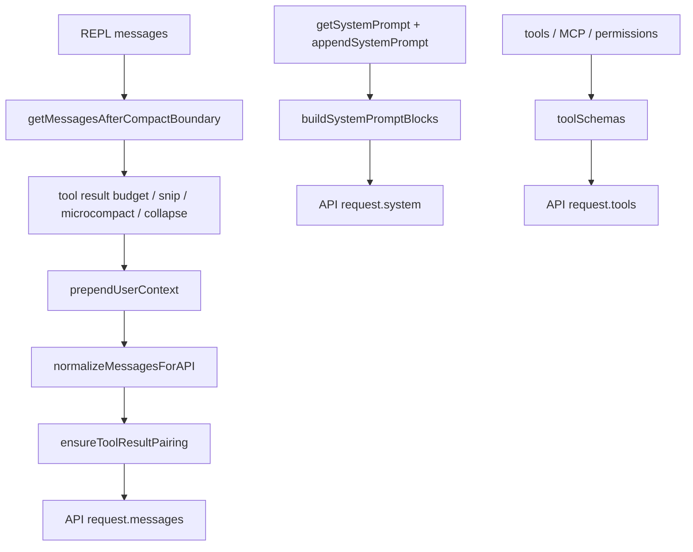
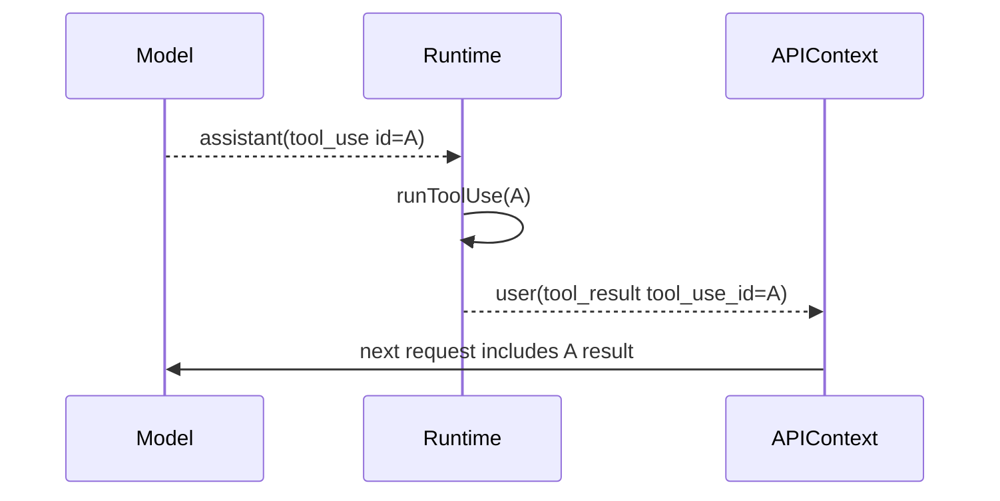
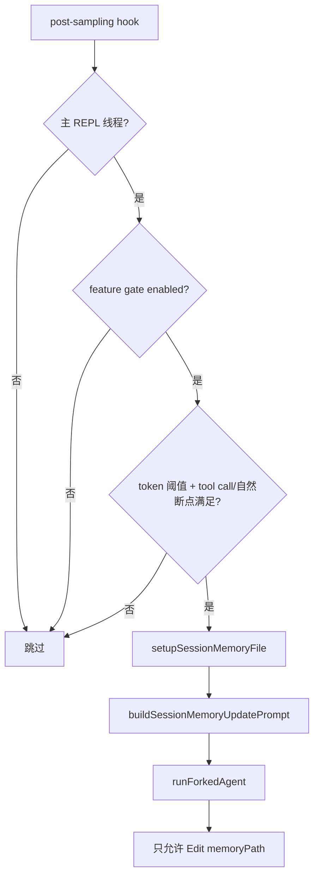
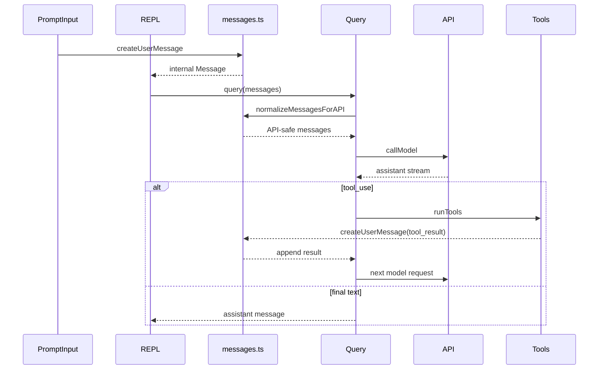
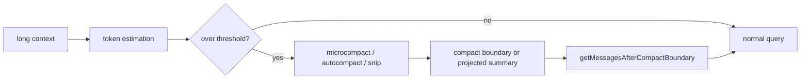

# 第 7 章：消息系统与对话上下文源码导读

## 本章定位

第 7 章承接第 6 章 AppState。AppState 是 runtime 控制平面，消息系统则是 Agent 能持续工作的上下文载体。

本章主线：

```text
REPL messages
  -> createUserMessage / createAssistantMessage / createSystemMessage
  -> normalizeMessagesForAPI
  -> tool_use / tool_result pairing
  -> token estimation / context analysis
  -> compact boundary
  -> query()
```

本章为第 8 章 Agent 查询循环准备能力：你要先知道 query 消费的不是 UI 上的一串文本，而是一组带类型、来源、工具关系、压缩边界和 API 约束的消息。

## 面向高级前端工程师的学习价值

不要把 Claude Code 的 message 看成普通 chat item。它更接近一个运行时 event log：

| 前端熟悉对象 | Claude Code message 的差异 |
| --- | --- |
| chat list item | 同时服务 UI、API、session log、tool pairing |
| optimistic message | 可能带 `tool_use`、`tool_result`、compact boundary |
| event sourcing | 消息可被 normalize、repair、compact、filter |
| render model | UI 可见消息不等于 API 上下文消息 |

AI CLI 的关键张力是：用户要看到完整过程，模型要拿到合法上下文，API 要求 tool_use/tool_result 成对，长期会话还要被压缩。

## 学习目标

1. 找到消息创建函数和 REPL 消息状态的连接点。
2. 证明 `normalizeMessagesForAPI` 是 UI message 到 API message 的边界。
3. 解释 tool_use/tool_result pairing 为什么是消息系统的硬约束。
4. 找到 token estimation、context analysis、compact boundary 如何读消息。
5. 在 `learning-framework` 中复刻简化 message model、normalize、tool result pairing 检查。

## 前置知识

需要理解 Anthropic Messages API 的 role/content block 概念、tool use 基本协议、流式 assistant message 的增量更新。本章不讲基础聊天 UI、React list 渲染、普通 JSON schema。

## 核心概念讲解

### 1. 消息为什么存在

源码锚点：

```bash
rg -n "createUserMessage|createAssistantMessage|createSystemMessage|createCommandInputMessage" claudecode-project/src/utils/messages.ts claudecode-project/src/screens/REPL.tsx
```

消息不是展示层 DTO，而是主链路中的共享事实：

```text
PromptInput
  -> UserMessage
  -> query
  -> AssistantMessage(tool_use?)
  -> runTools
  -> UserMessage(tool_result)
  -> query continues
```

### 2. normalizeMessagesForAPI 是协议边界

源码锚点：

```bash
rg -n "normalizeMessagesForAPI|ensureToolResultPairing|tool_use|tool_result" claudecode-project/src/utils/messages.ts claudecode-project/src/query.ts
```

UI 消息可以包含系统提示、compact boundary、progress、local command output 等信息。API 上下文必须满足模型协议。`normalizeMessagesForAPI` 的价值是把内部消息流整理成 API 能接受的结构。

更准确地说，Claude Code 里至少有三种“上下文”同时存在：

| 上下文 | 代表数据 | 生命周期 | 进入 API 的方式 |
| --- | --- | --- | --- |
| UI/runtime messages | `Message[]`、progress、compact boundary、attachment | REPL 当前会话全程维护 | 先被过滤/修复/压缩，再 normalize |
| userContext/systemContext | `getUserContext()`、`getSystemContext()`、coordinator context | 每轮 query 前重新读取 | userContext 通过 `prependUserContext` 进入 messages；systemContext append 到 system prompt |
| memory/compact context | compact summary、session memory file、context collapse projection | 长会话或阈值触发 | 以 summary message、forked agent 产物或 compact boundary 形式回到 messages |

这也是为什么“接口调用入参”不能只看 `deps.callModel(...)` 那一行。真正的入参构造分三层：



### 3. tool_use/tool_result 是成对约束

源码锚点：

```bash
rg -n "ensureToolResultPairing|missing tool_result|orphaned tool_result|tool_use_id|yieldMissingToolResultBlocks" claudecode-project/src/utils/messages.ts claudecode-project/src/query.ts
```

如果 assistant 产生 tool_use，但后续没有对应 tool_result，API 会拒绝或会话会卡死。Claude Code 在消息层做防御修复：补 synthetic error result、移除 orphan result、去重重复 id。

这不是“为了显示工具结果”的 UI 约定，而是模型协议约束。assistant 发出：

```json
{ "type": "tool_use", "id": "toolu_123", "name": "Read", "input": { "file_path": "..." } }
```

下一轮 API messages 中必须出现 user role 的：

```json
{ "type": "tool_result", "tool_use_id": "toolu_123", "content": "..." }
```

所以消息系统要维护 `tool_use_id` 的配对关系。否则下一次 `normalizeMessagesForAPI` 后，API 看到的是“模型要求执行一个工具，但运行环境没有给 observation”，这会破坏 ReAct 循环。



### 4. token 与 compact 依赖消息结构

源码锚点：

```bash
rg -n "tokenCountWithEstimation|tokenCountFromLastAPIResponse|compact_boundary|microcompact|isCompactBoundaryMessage|getMessagesAfterCompactBoundary" claudecode-project/src/utils/tokens.ts claudecode-project/src/utils/messages.ts
```

上下文管理不是简单按数组长度裁剪，而是结合 API usage、tool_result、compact boundary、snip/microcompact/autocompact 的多层策略。

### 5. 记忆相关机制有哪些

本课程里容易把 memory 混成一个概念。源码里至少要分开看：

| 机制 | 目的 | 触发点 | 关键源码 |
| --- | --- | --- | --- |
| compact boundary | 长上下文压缩后保留摘要和边界 | token pressure、手动/自动 compact | `services/compact/*`、`createCompactBoundaryMessage` |
| microcompact / cached microcompact | 局部压缩工具结果和长内容 | query 前预算检查 | `query.ts` 中 `deps.microcompact(...)` |
| session memory | 把当前会话要点写入专门 memory 文件 | post-sampling hook，token 阈值 + tool call 阈值 | `services/SessionMemory/sessionMemory.ts` |
| relevant memory prefetch | query 开始时预取相关记忆 | query loop 入口 | `startRelevantMemoryPrefetch(...)` |
| tool readFileState / file history | 工具执行期间缓存读文件状态、防止 diff 基于错误版本 | tool execution context | `ToolUseContext` |

session memory 的触发条件不是“每轮都总结”。它要求 token 增长达到阈值，并结合 tool call 数或自然对话断点：

```ts
const hasMetTokenThreshold = hasMetUpdateThreshold(currentTokenCount)
const toolCallsSinceLastUpdate = countToolCallsSince(messages, lastMemoryMessageUuid)
const hasMetToolCallThreshold =
  toolCallsSinceLastUpdate >= getToolCallsBetweenUpdates()
const hasToolCallsInLastTurn = hasToolCallsInLastAssistantTurn(messages)

const shouldExtract =
  (hasMetTokenThreshold && hasMetToolCallThreshold) ||
  (hasMetTokenThreshold && !hasToolCallsInLastTurn)
```

设计理由：

1. **token 阈值是硬门槛**：避免每次工具调用都启动总结 agent，污染主会话性能。
2. **tool call 阈值捕获“操作密度”**：大量工具调用通常意味着会话状态变化多，值得沉淀。
3. **最后一轮有 tool call 时谨慎**：避免在 tool_use/tool_result 尚处于复杂配对附近时写记忆。
4. **forked agent 隔离执行**：session memory 用 `runForkedAgent`，并用 `createMemoryFileCanUseTool(memoryPath)` 限制只允许编辑 memory 文件，避免总结任务改到用户工程文件。



## 核心源码地图

| 文件 | 本章看什么 | 不看什么 | 后续 |
| --- | --- | --- | --- |
| `src/utils/messages.ts` | create/normalize/pairing/compact boundary | 每个 formatter 细节 | 第 8、14 章回看 |
| `src/screens/REPL.tsx` | `messages`、`messagesRef`、stream event 如何 append | REPL 全部逻辑 | 第 5 章已讲 |
| `src/query.ts` | query 如何消费 normalized messages，如何产生 tool_result continuation | query loop 全量 | 第 8 章深入 |
| `src/utils/tokens.ts` | token estimation 与上下文大小 | 计费细节 | 第 8、14 章 |
| `src/utils/contextAnalysis.ts` | 按 block 类型统计上下文 | 指标上报细节 | 附录/高级专题 |
| `src/services/compact/*` | compact 对消息的改写 | compact 算法全量 | 第 14 章 |

## 主调用链 / 主数据流



## 源码阅读路线

### 路线一：消息创建

```bash
rg -n "createUserMessage|createAssistantMessage|createSystemMessage" claudecode-project/src/utils/messages.ts
rg -n "createUserMessage|createAssistantMessage|setMessages" claudecode-project/src/screens/REPL.tsx claudecode-project/src/utils/handlePromptSubmit.ts
```

判断：消息从输入处理和 query stream 两端进入同一数组。

### 路线二：API normalize

```bash
rg -n "normalizeMessagesForAPI|ensureToolResultPairing" claudecode-project/src/utils/messages.ts
rg -n "normalizeMessagesForAPI" claudecode-project/src/query.ts claudecode-project/src/utils/contextAnalysis.ts
```

判断：normalize 是 API 边界，不是 UI 渲染逻辑。

### 路线三：工具消息配对

```bash
rg -n "tool_use_id|missing tool_result|orphaned tool_result|yieldMissingToolResultBlocks" claudecode-project/src/utils/messages.ts claudecode-project/src/query.ts
```

判断：工具调用的正确性在消息层和 query 层都有防御。

### 路线四：上下文与压缩

```bash
rg -n "tokenCountWithEstimation|compact_boundary|getMessagesAfterCompactBoundary|createMicrocompactBoundaryMessage" claudecode-project/src/utils/tokens.ts claudecode-project/src/utils/messages.ts
```

判断：上下文管理依赖 message metadata 和 content block。

## 5 分钟源码速验

```bash
rg -n "createUserMessage|createAssistantMessage|createSystemMessage" claudecode-project/src/utils/messages.ts
rg -n "normalizeMessagesForAPI" claudecode-project/src/utils/messages.ts claudecode-project/src/query.ts
rg -n "ensureToolResultPairing|yieldMissingToolResultBlocks" claudecode-project/src/utils/messages.ts claudecode-project/src/query.ts
rg -n "tokenCountWithEstimation|compact_boundary" claudecode-project/src/utils/tokens.ts claudecode-project/src/utils/messages.ts
rg -n "messagesRef|deferredMessages|displayedMessages|<Messages" claudecode-project/src/screens/REPL.tsx
```

依次确认：创建、normalize、工具配对、token/compact、UI 渲染五条链路都真实存在。

## 关键模块逐段导读

`utils/messages.ts` 是消息系统的核心，不要逐行读。按职责看：

1. 创建层：`createUserMessage`、`createAssistantMessage`、`createSystemMessage` 把不同来源包装成内部消息。
2. API 边界层：`normalizeMessagesForAPI` 处理 role/content block、thinking、tool result、compact 后的过滤。
3. 修复层：`ensureToolResultPairing` 防止 tool_use/tool_result 协议破裂。
4. compact 边界层：`createCompactBoundaryMessage`、`isCompactBoundaryMessage`、`getMessagesAfterCompactBoundary` 标记上下文切片。
5. 辅助分析层：tokens/context analysis 根据 block 类型估算成本和上下文压力。

## 与前后章节的关系

第 6 章解释了 AppState；本章说明消息为什么没有简单全部塞进 AppState。第 8 章会沿着 normalized messages 进入 `query()`。第 9-11 章会继续展开 tool_use/tool_result 与工具协议、权限的关系。第 14 章会回到 compact、session memory、remote message adapter。

## 教学可视化表达方式



## 实践任务

1. 源码定位：记录 `createUserMessage`、`normalizeMessagesForAPI`、`ensureToolResultPairing` 的文件名和行号。
2. 调用链追踪：画出一次 tool_use 到 tool_result 的消息链，产出 `tool_use_id` 配对图。
3. 行号任务：找出 `query.ts` 中调用 `normalizeMessagesForAPI` 和 `runTools` 的位置。
4. learning-framework 复刻：实现 `Message` union、`normalizeMessagesForAPI`、`ensureToolResultPairing`。
5. 进阶分析：解释为什么 UI message 和 API message 不能共用完全相同的数据结构。

产出格式统一写入 `docs/notes/ch07-message-context.md`。

## 常见误区

1. 把 message 当 chat item。真实 message 同时服务 UI、API、tool、compact。
2. 忽略 tool_result 配对。工具协议错了，后续 query 会被拖垮。
3. 以为 compact 是删除历史。实际是引入边界和摘要，让 query 继续。
4. 认为 normalize 只是格式转换。它还承担修复、防御、过滤职责。

## 本章总结

本章建立的模型：

```text
Message = UI event + API context + tool protocol + compact metadata
```

最重要证据链：

```text
REPL messages
  -> utils/messages.ts create/normalize
  -> query.ts consumes normalized context
  -> tool_use/tool_result pairing
  -> tokens/compact manage long context
```

## 下一章衔接

第 8 章继续追踪 `query()`：消息进入 Agent loop 后，如何触发 API、stream、tool_use、runTools、继续下一轮。

未确认源码点：当前源码 import `../types/message.js`，但本轮未定位到对应物理源文件；第 2 轮整体验证需要继续查构建产物或生成类型入口。
