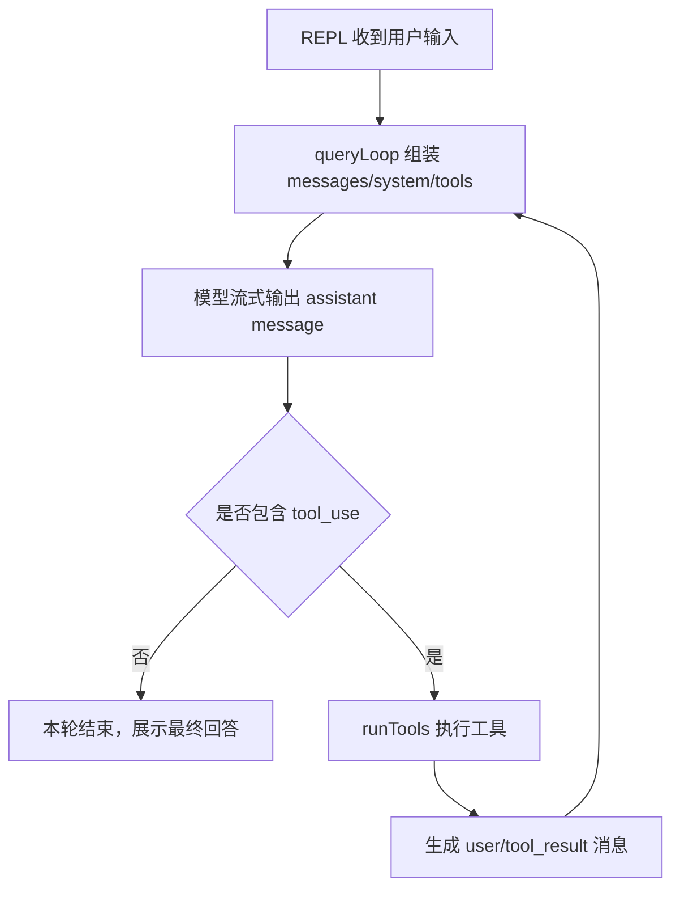
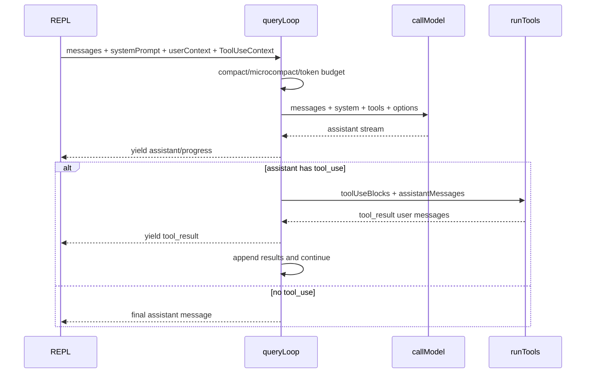

# 第 8 章：Agent 查询循环源码导读

## 本章定位

第 8 章进入 Claude Code 的核心 Agent loop：`src/query.ts`。前面章节已经建立了入口、TUI、REPL、AppState、Message，本章看这些输入如何驱动模型和工具多轮协作。

主线：

```text
REPL.onQuery
  -> query(messages, systemPrompt, tools, canUseTool, toolUseContext)
  -> normalizeMessagesForAPI
  -> callModel stream
  -> assistant message
  -> tool_use?
  -> runTools
  -> tool_result messages
  -> continue queryLoop
```

## 面向高级前端工程师的学习价值

`query()` 不是普通 request 函数，而是 AsyncGenerator runtime。它边请求、边 yield UI 事件、边处理工具、边决定是否继续下一轮。

前端类比：

| 前端概念 | query loop 中的升级版 |
| --- | --- |
| fetch request | streamed model call |
| loading state | generator yield stream events |
| retry | prompt-too-long / max-output recovery |
| effect pipeline | tool_use -> runTools -> continuation |
| route guard | maxTurns / stop hooks / abort |

## 学习目标

1. 追踪 `REPL -> query -> queryLoop -> callModel`。
2. 解释为什么 `query()` 使用 AsyncGenerator。
3. 找到 stream event、assistant message、tool_use、tool_result 的 yield 点。
4. 说明 runTools 后为什么要继续下一轮 query。
5. 在 learning-framework 中复刻一个能 yield 文本、工具调用、工具结果、继续轮次的 generator。

## 前置知识

需要理解 AsyncGenerator、streaming response、tool use 协议、AbortController。不会展开 API client、模型参数、token 算法细节。

## 核心概念讲解

### 0. ReAct 循环模式从哪里来

ReAct 是 Reason + Act 的缩写，来自论文 *ReAct: Synergizing Reasoning and Acting in Language Models*。它的核心不是某个框架 API，而是一种 Agent 控制模式：

```text
模型先基于上下文推理
  -> 需要外部信息或副作用时发出 action/tool_use
  -> 运行环境执行 action
  -> observation/tool_result 回到上下文
  -> 模型继续推理或给最终回答
```

Claude Code 没有把源码里的函数命名成 `reactLoop()`，但 `queryLoop()` 做的正是这个控制模式。这里的 `Thought` 不一定以明文暴露；在支持 thinking 的模型上可能存在 thinking block，在普通路径上则体现在模型根据 messages、system prompt、tool schema 选择是否发出 `tool_use`。这里的 `Act` 是 assistant message 里的 `tool_use` content block，`Observation` 是后续 user message 里的 `tool_result` block。



类似模式在源码里还有几类：

| 模式 | 源码位置 | 共同点 | 差异 |
| --- | --- | --- | --- |
| 主 Agent loop | `src/query.ts` | 模型输出驱动下一步动作 | 面向用户会话，维护完整 messages |
| tool orchestration | `src/services/tools/toolOrchestration.ts` | action 执行后回传结果 | 只负责工具批次，不直接请求模型 |
| compact / session memory forked agent | `src/services/compact/*`、`src/services/SessionMemory/*` | 用子任务读取上下文并产出结果 | 不是用户主循环，权限和上下文更窄 |
| stop hooks | `src/query/stopHooks.ts` | turn 结束后可能触发继续或阻断 | 属于控制面，不是模型 tool_use |

### 1. query 为什么存在

源码锚点：

```bash
rg -n "export async function\\* query|async function\\* queryLoop|yield \\{ type: 'stream_request_start' \\}|deps.callModel|runTools" claudecode-project/src/query.ts
```

query 是 REPL 和模型/工具 runtime 的分界线。REPL 不应该知道模型如何恢复、工具如何继续、compact 如何触发；这些都收进 query loop。

### 2. AsyncGenerator 是 UI 和 runtime 的桥

源码锚点：

```bash
rg -n "for await \\(const event of query|yield yieldMessage|yield result.message|yield createSystemMessage" claudecode-project/src/screens/REPL.tsx claudecode-project/src/query.ts
```

REPL 可以 `for await` 消费 query 事件，边收到边更新 UI，而 query 内部可以在每个阶段 yield：请求开始、assistant delta、工具进度、工具结果、compact boundary、错误恢复。

### 3. tool_use 让 query 从单轮变成多轮

源码锚点：

```bash
rg -n "toolUseBlocks|runTools\\(|for await \\(const update of toolUpdates\\)|nextTurnCount|maxTurns" claudecode-project/src/query.ts
```

模型返回 tool_use 不是结束，而是中间态：

```text
assistant(tool_use)
  -> runTools
  -> user(tool_result)
  -> queryLoop(next turn)
```

核心源码形状如下。重点看三件事：每轮先准备 `messagesForQuery`；流式响应中收集 `toolUseBlocks`；工具结果再追加回下一轮上下文。

```ts
let messagesForQuery = [...getMessagesAfterCompactBoundary(messages)]

for await (const message of deps.callModel({
  messages: prependUserContext(messagesForQuery, userContext),
  systemPrompt: fullSystemPrompt,
  tools: toolUseContext.options.tools,
  options: {
    model: currentModel,
    async getToolPermissionContext() {
      return toolUseContext.getAppState().toolPermissionContext
    },
    mcpTools: appState.mcp.tools,
    queryTracking,
  },
})) {
  if (message.type === 'assistant') {
    assistantMessages.push(message)
    toolUseBlocks.push(
      ...message.message.content.filter(block => block.type === 'tool_use'),
    )
  }
}
```

这段代码解释了为什么 Claude Code 的 Agent loop 不是“一次 request 返回最终文本”。它必须允许模型在中途把“我需要读文件/跑命令/改文件”的动作交给 runtime，再把 observation 回灌给模型继续。

### 4. query 也负责上下文压力

源码锚点：

```bash
rg -n "microcompact|autocompact|tokenBudget|prompt too long|max_output_tokens|buildPostCompactMessages" claudecode-project/src/query.ts claudecode-project/src/query/*.ts
```

Agent loop 不能只处理 happy path。它还要在上下文过长、输出过长、compact 触发、stop hooks 介入时保持会话继续。

## 核心源码地图

| 文件 | 本章看什么 | 不看什么 | 后续 |
| --- | --- | --- | --- |
| `src/query.ts` | query generator、loop、tool continuation、recovery | 每个 feature gate 分支 | 第 14 章回看 compact |
| `src/query/config.ts` | query 配置组织 | 模型策略细节 | 高级专题 |
| `src/query/tokenBudget.ts` | budget 检查入口 | 算法细节 | 第 14 章 |
| `src/services/api/claude.ts` | callModel 边界 | API SDK 细节 | API 专题 |
| `src/services/tools/toolOrchestration.ts` | runTools 与 query 的连接 | 工具执行细节 | 第 10 章 |
| `src/query/stopHooks.ts` | turn end hooks | hook 生态全量 | 第 14 章 |

## 主调用链 / 主数据流



## 源码阅读路线

1. query 入口：

```bash
rg -n "export async function\\* query|async function\\* queryLoop|yield\\* queryLoop" claudecode-project/src/query.ts
```

2. 模型请求：

```bash
rg -n "stream_request_start|deps.callModel|normalizeMessagesForAPI|for await \\(const message of deps.callModel" claudecode-project/src/query.ts
```

3. 工具继续：

```bash
rg -n "toolUseBlocks|runTools\\(|toolUpdates|nextTurnCount|maxTurns" claudecode-project/src/query.ts
```

4. 恢复与压缩：

```bash
rg -n "prompt-too-long|prompt too long|max_output_tokens|autocompact|microcompact|buildPostCompactMessages" claudecode-project/src/query.ts
```

5. stop hooks：

```bash
rg -n "handleStopHooks|stopHookActive|preventContinuation|blockingErrors" claudecode-project/src/query.ts claudecode-project/src/query/stopHooks.ts
```

## 5 分钟源码速验

```bash
rg -n "export async function\\* query" claudecode-project/src/query.ts
rg -n "yield \\{ type: 'stream_request_start' \\}|deps.callModel" claudecode-project/src/query.ts
rg -n "toolUseBlocks|runTools\\(" claudecode-project/src/query.ts
rg -n "for await \\(const update of toolUpdates\\)" claudecode-project/src/query.ts
rg -n "maxTurns|handleStopHooks|autocompact|microcompact" claudecode-project/src/query.ts
```

## 关键模块逐段导读

1. `query()`：外部入口，包住 queryLoop，负责 generator 生命周期。
2. `queryLoop()`：真正主循环，管理轮次、messagesForQuery、tracking、stop hook 状态。
3. 请求前：normalize、token budget、compact/microcompact。
4. 请求中：`deps.callModel` stream yield assistant message。
5. 请求后：收集 tool_use，决定是否 runTools。
6. 工具后：tool_result 作为 user message 回到 messages，触发下一轮。
7. 退出条件：无 tool_use、maxTurns、abort、stop hooks、recoverable error 处理结束。

### API 入参到底从哪里来

一次模型请求不是只把用户输入传给 API。`REPL.tsx` 和 `query.ts` 分层拼出了这些入参：

| API 入参 | 来源 | 为什么在这里放入 |
| --- | --- | --- |
| `messages` | REPL 当前消息数组，经 compact 边界、tool result budget、`prependUserContext`、`normalizeMessagesForAPI` 处理 | 保证模型看到的是协议合法、上下文可控的会话 |
| `system` / `systemPrompt` | `getSystemPrompt(...)` + `buildEffectiveSystemPrompt(...)` + `appendSystemContext(...)` | 把产品规则、工具说明、用户追加 system prompt、系统上下文合并 |
| `tools` | `getToolUseContext(...).options.tools`，来自内置工具、MCP、权限过滤 | 决定模型本轮能发出哪些 `tool_use` |
| `model` | `getRuntimeMainLoopModel(...)` | permission mode、plan mode、上下文长度可能改变主循环模型 |
| `tool permission context` | `options.getToolPermissionContext()` 运行时读取 AppState | 权限可能在异步工具执行期间变化，不能只用旧闭包 |
| `mcpTools` / `hasPendingMcpServers` | `appState.mcp` | 让 API 层知道 MCP 工具状态和动态工具信息 |
| `queryTracking` | query loop 每轮创建/递增 | 追踪一次 ReAct 链路的深度和日志归因 |

`REPL.tsx` 负责准备 prompt/context：

```ts
const [,, defaultSystemPrompt, baseUserContext, systemContext] =
  await Promise.all([
    checkAndDisableBypassPermissionsIfNeeded(...),
    checkAndDisableAutoModeIfNeeded(...),
    getSystemPrompt(freshTools, mainLoopModelParam, directories, freshMcpClients),
    getUserContext(),
    getSystemContext(),
  ])

const userContext = {
  ...baseUserContext,
  ...getCoordinatorUserContext(freshMcpClients, scratchpadDir),
}

const systemPrompt = buildEffectiveSystemPrompt({
  toolUseContext,
  customSystemPrompt,
  defaultSystemPrompt,
  appendSystemPrompt,
})
```

`services/api/claude.ts` 再做 API 边界处理：

```ts
let messagesForAPI = normalizeMessagesForAPI(messages, filteredTools)
messagesForAPI = ensureToolResultPairing(messagesForAPI)

const system = buildSystemPromptBlocks(systemPrompt, enablePromptCaching, {
  querySource: options.querySource,
})

return {
  model: normalizeModelStringForAPI(options.model),
  messages: addCacheBreakpoints(messagesForAPI, enablePromptCaching, ...),
  system,
  tools: allTools,
  tool_choice: options.toolChoice,
  max_tokens: maxOutputTokens,
  thinking,
}
```

这里的设计取舍是：REPL 负责收集“当前 turn 的运行时上下文”，query 负责维护“Agent loop 的连续性”，API 层负责“把内部表示转成模型供应商接受的请求体”。这样做避免了一个巨型函数同时懂 UI、权限、消息修复、缓存和 API 细节。

## 与前后章节的关系

承接第 7 章 normalized messages，连接第 9-10 章 tool 抽象和内置工具。第 11 章的 permission 会在 runTools/checkPermissions 路径介入。第 14 章会回看 compact、stop hooks、telemetry、performance。

## 教学可视化表达方式

```text
messages -> API -> assistant(text) -> stop
```

```text
messages -> API -> assistant(tool_use)
  -> runTools -> user(tool_result)
  -> API -> assistant(text)
```

```text
query loop
  -> compact check
  -> model stream
  -> tool orchestration
  -> stop hooks
  -> continuation decision
```

## 实践任务

1. 定位 `query()`、`queryLoop()`、`deps.callModel`、`runTools` 行号。
2. 追踪一次 tool_use 后继续下一轮的调用链，画出消息数组变化。
3. 记录所有 `yield` 类型，分类为 UI event、message、recovery、tool result。
4. 在 learning-framework 实现 `async function* query()`：yield 请求开始、assistant 文本、tool_use、tool_result、最终文本。
5. 进阶分析：为什么 query loop 不能写成一个返回 Promise<Message[]> 的函数？

## 常见误区

1. 把 query 当 API wrapper。它是 Agent loop。
2. 忽略 generator 的 UI 价值。没有 yield，TUI 只能等整轮结束。
3. 把 tool_use 当模型最终输出。它只是下一步动作。
4. 把 compact 当外围功能。上下文压力直接影响 query 继续能力。

## 本章总结

核心模型：

```text
query = streamed model call + tool continuation + context recovery + turn control
```

证据链：

```text
REPL for-await query
  -> queryLoop
  -> callModel
  -> collect tool_use
  -> runTools
  -> append tool_result
  -> continue / stop
```

## 下一章衔接

第 9 章拆 Tool 抽象：query 发现 tool_use 后，为什么任意工具都能被统一调度、校验、权限检查、执行和渲染。
