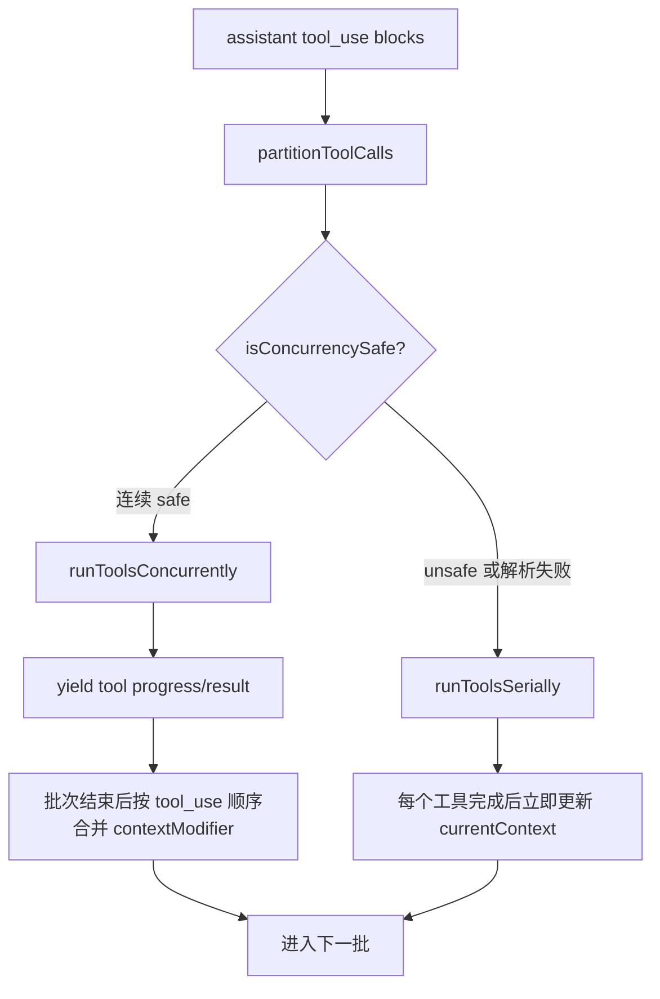
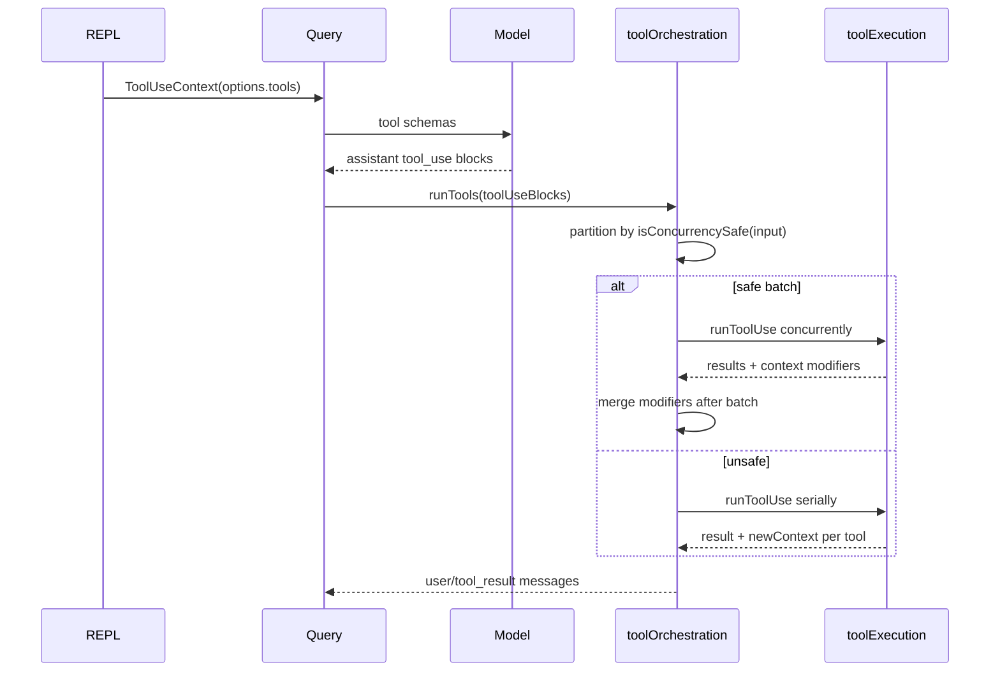
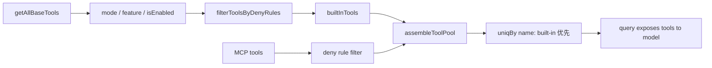

# 第 10 章：内置工具系统源码导读

## 本章定位

第 10 章承接第 9 章 Tool 协议，开始看工具池如何组装。Tool interface 解决“单个工具长什么样”，`tools.ts` 和 tool orchestration 解决“当前 turn 到底有哪些工具可用、如何执行”。

## 面向高级前端工程师的学习价值

这章像大型前端里的 plugin registry + feature gate + capability filtering，但风险更高：工具池直接决定模型能操作本地系统的能力边界。

## 学习目标

1. 找到 `getAllBaseTools`、`getTools`、`assembleToolPool`。
2. 解释 built-in tools、special tools、MCP tools 的合并边界。
3. 说明 permission deny filter 为什么在工具暴露前就介入。
4. 追踪 `runTools` 如何串/并行执行工具。
5. 在 learning-framework 中实现工具池和并发安全调度。

## 前置知识

已理解第 9 章 Tool 协议。本章不讲每个工具的业务细节。

## 核心概念讲解

### 1. 工具池为什么存在

```bash
rg -n "getAllBaseTools|getTools|assembleToolPool|getToolsForDefaultPreset|filterToolsByDenyRules" claudecode-project/src/tools.ts
```

模型每轮可见工具不是固定列表，而由 feature gate、permission mode、deny rules、MCP tools、special tools、isEnabled 共同决定。

### 2. getAllBaseTools 是内置工具源头

`getAllBaseTools()` 是内置工具全集。它不是每轮最终工具池，后面还要过滤。

### 3. getTools 是内置工具过滤结果

`getTools(permissionContext)` 会按 permission 和模式过滤。简单模式、REPL mode、deny rules 都会改变最终暴露。

### 4. assembleToolPool 合并 MCP

```bash
rg -n "assembleToolPool|mcpTools|uniqBy|builtInTools take precedence" claudecode-project/src/tools.ts
```

内置工具优先，MCP 工具被 deny rules 过滤后再合并去重。这个顺序避免 MCP 工具覆盖内置关键能力。

### 5. runTools 管理串并行

```bash
rg -n "partitionToolCalls|runToolsSerially|runToolsConcurrently|isConcurrencySafe" claudecode-project/src/services/tools/toolOrchestration.ts
```

工具执行不是全并发。`isConcurrencySafe` 决定是否能并发批处理。

这个设计的关键不是“并发更快”这么简单，而是把工具分成两类状态语义：

| 工具类型 | 典型例子 | 为什么可以/不可以并发 |
| --- | --- | --- |
| 读型、无副作用、结果不依赖执行顺序 | Read、Glob、Grep、部分诊断类工具 | 多个读取之间通常不会修改共享状态，并发可以降低等待时间 |
| 写型、有副作用、会修改文件/权限/进程/上下文 | Edit、Write、Bash、权限相关工具 | 顺序决定最终状态；并发写可能造成覆盖、diff 基于旧内容、权限弹窗交错 |
| 混合型或解析失败 | Bash、MCP 工具、输入 schema 失败 | 保守视为不安全，避免把未知副作用并发化 |

核心代码在 `partitionToolCalls`。它不是按工具名硬编码，而是先用工具的 `inputSchema` 解析模型给的 input，再调用工具自己的 `isConcurrencySafe(parsedInput)`：

```ts
function partitionToolCalls(
  toolUseMessages: ToolUseBlock[],
  toolUseContext: ToolUseContext,
): Batch[] {
  return toolUseMessages.reduce((acc: Batch[], toolUse) => {
    const tool = findToolByName(toolUseContext.options.tools, toolUse.name)
    const parsedInput = tool?.inputSchema.safeParse(toolUse.input)
    const isConcurrencySafe = parsedInput?.success
      ? (() => {
          try {
            return Boolean(tool?.isConcurrencySafe(parsedInput.data))
          } catch {
            return false
          }
        })()
      : false

    if (isConcurrencySafe && acc[acc.length - 1]?.isConcurrencySafe) {
      acc[acc.length - 1]!.blocks.push(toolUse)
    } else {
      acc.push({ isConcurrencySafe, blocks: [toolUse] })
    }
    return acc
  }, [])
}
```

这里有三个值得学习的设计点：

1. **并发资格由工具自己判断**：同一个工具可能对某些 input 安全、对另一些 input 不安全。例如命令类工具不能只按名字决定。
2. **解析失败即不并发**：模型 input 不可信，schema 都过不了时，调度层不应该猜测它是否安全。
3. **只合并连续 safe 批次**：保留模型给出的 tool_use 顺序。遇到 unsafe 工具就切断批次，保证它前后的状态边界清楚。

`runTools` 的执行策略也体现了这个边界：

```ts
for (const { isConcurrencySafe, blocks } of partitionToolCalls(...)) {
  if (isConcurrencySafe) {
    for await (const update of runToolsConcurrently(blocks, ...)) {
      yield { message: update.message, newContext: currentContext }
    }
    for (const block of blocks) {
      for (const modifier of queuedContextModifiers[block.id] ?? []) {
        currentContext = modifier(currentContext)
      }
    }
  } else {
    for await (const update of runToolsSerially(blocks, ...)) {
      if (update.newContext) currentContext = update.newContext
      yield { message: update.message, newContext: currentContext }
    }
  }
}
```

为什么并发读的 context 修改也要排队到批次结束后再应用？因为并发任务共享同一个 `currentContext` 起点。如果某个并发工具一边运行一边修改上下文，另一个工具可能读到半更新状态，结果就变成竞态。Claude Code 选择“并发执行、顺序合并 contextModifier”，让读取阶段并行，状态提交阶段确定。



这就是“读的时候并发，写的时候顺序写”的源码依据。它本质上是在 Agent runtime 里实现一个小型事务调度器：读可以并行，写要按 happens-before 顺序提交。

## 核心源码地图

| 文件 | 看什么 | 不看什么 | 后续 |
| --- | --- | --- | --- |
| `src/tools.ts` | 工具注册、过滤、MCP 合并 | 每个工具实现 | 第 13 章 |
| `src/services/tools/toolOrchestration.ts` | 串并行调度 | 单工具执行细节 | 本章重点 |
| `src/services/tools/toolExecution.ts` | 单工具执行 pipeline | hooks 全量 | 第 11 章 |
| `src/tools/FileReadTool/*` | 只读工具样例 | 读取边角 | 实践参考 |
| `src/tools/BashTool/*` | 高风险工具样例 | bash parser 全量 | 第 11 章 |
| `src/tools/AgentTool/*` | 子 Agent 工具 | 远程/后台全量 | 第 14 章 |

## 主调用链 / 主数据流



## 源码阅读路线

```bash
rg -n "export function getAllBaseTools|export const getTools|export function assembleToolPool" claudecode-project/src/tools.ts
rg -n "filterToolsByDenyRules|getDenyRuleForTool|specialTools|isEnabled" claudecode-project/src/tools.ts
rg -n "partitionToolCalls|runToolsSerially|runToolsConcurrently" claudecode-project/src/services/tools/toolOrchestration.ts
rg -n "StreamingToolExecutor|canExecuteTool|getCompletedResults" claudecode-project/src/services/tools/StreamingToolExecutor.ts
```

## 5 分钟源码速验

```bash
rg -n "getAllBaseTools\\(" claudecode-project/src/tools.ts
rg -n "filterToolsByDenyRules|assembleToolPool" claudecode-project/src/tools.ts
rg -n "runTools\\(|partitionToolCalls" claudecode-project/src/services/tools/toolOrchestration.ts
rg -n "FileReadTool|FileWriteTool|BashTool|AgentTool" claudecode-project/src/tools.ts
```

## 关键模块逐段导读

`tools.ts`：

1. import 内置工具。
2. 定义 tool presets。
3. `getAllBaseTools` 给出全集。
4. `filterToolsByDenyRules` 提前按权限剔除。
5. `getTools` 按模式/feature/isEnabled 得出内置池。
6. `assembleToolPool` 合并 MCP 并去重。

`toolOrchestration.ts`：

1. `partitionToolCalls` 按 concurrency safe 分批。
2. safe 批次并发执行。
3. unsafe 工具串行执行。
4. 每次 update 都 yield message/context。

## 与前后章节的关系

第 9 章定义单工具协议，本章定义工具池和执行调度。第 11 章深入为什么工具池暴露和执行都要受权限影响。第 13 章解释 MCP 工具如何进入工具池。

## 教学可视化表达方式



```text
Read/Grep/Glob: lower risk, often concurrency safe
Bash/Write/Edit: higher risk, permission heavy
Agent: orchestration tool, may spawn tasks
```

## 实践任务

1. 定位 `getAllBaseTools`、`getTools`、`assembleToolPool` 行号。
2. 记录至少 8 个内置工具名及其文件路径。
3. 追踪 deny rule 如何在工具池暴露前过滤工具。
4. learning-framework 实现 `getTools(permissionContext)` 和 `assembleToolPool(mcpTools)`。
5. 进阶分析：为什么 built-in tools 要优先于 MCP tools 去重？

## 常见误区

1. 以为工具列表固定。实际每轮可能变化。
2. 只看工具实现，忽略工具暴露前过滤。
3. 把并发安全当性能优化。它也是状态一致性边界。
4. 忽略 MCP 合并顺序。去重策略影响模型能调用哪个工具。

## 本章总结

核心证据链：

```text
tools.ts registers/filter tools
  -> assembleToolPool combines MCP
  -> query exposes tools
  -> runTools schedules by concurrency
```

## 下一章衔接

第 11 章进入权限系统：为什么工具池过滤还不够，执行时还要 ask/deny/allow、UI 弹窗、Bash 危险命令识别。
