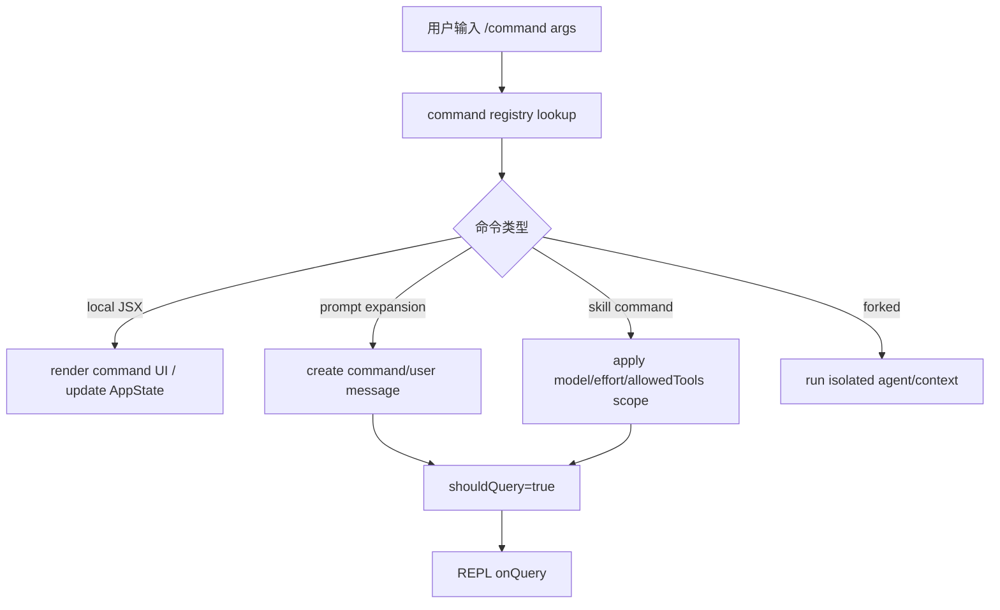

# 第 12 章：Slash Commands 命令体系源码导读

## 本章定位

第 12 章回到用户输入入口，但重点不是 CLI Commander，而是 REPL 内部的 `/command`。它承接第 5 章 `handlePromptSubmit/processUserInput`，解释用户输入如何分流成本地 UI、prompt expansion、skills/plugin command。

## 面向高级前端工程师的学习价值

Slash command 像前端应用中的 command palette，但它不是纯 UI 菜单。某些命令渲染本地 Ink UI，某些命令生成 prompt 交给模型，某些命令来自 skills/plugin/MCP。

## 学习目标

1. 定位 `commands.ts` 注册中心和 `types/command.ts`。
2. 区分 `local-jsx` command 和 `prompt` command。
3. 追踪 dynamic skills、plugin command、MCP command 如何进入命令列表。
4. 说明 remote mode 为什么要过滤命令。
5. 在 learning-framework 中实现 command registry + `/help` + prompt command。

## 前置知识

理解 REPL 输入提交、PromptInput、processUserInput。本章不讲 Commander。

## 核心概念讲解

### 1. Slash command 为什么存在

```bash
rg -n "export type Command|type: 'prompt'|type: 'local-jsx'" claudecode-project/src/types/command.ts
```

Slash command 为 REPL 提供本地控制面：改模型、清空、帮助、权限配置、compact、skills、plugin 管理。

### 2. local-jsx 与 prompt 是两条路径

```bash
rg -n "type: 'local-jsx'|type: 'prompt'" claudecode-project/src/commands -g '*.{ts,tsx}' | head -80
```

`local-jsx` 渲染本地终端 UI；`prompt` 生成文本进入模型上下文。这是本章最重要的分流。

### 3. commands.ts 是注册和过滤中心

```bash
rg -n "dynamic skills|filterCommandsForRemoteMode|getCommand|hasCommand|BRIDGE_SAFE_COMMANDS|local-jsx|prompt" claudecode-project/src/commands.ts
```

命令列表不是静态数组，它会插入 plugin skills、dynamic skills，并按 remote/bridge 场景过滤。

### 4. skills 也可以变成 command

```bash
rg -n "type: 'prompt'|loadSkillsDir|dynamic skills|skill.type === 'prompt'" claudecode-project/src/skills/loadSkillsDir.ts claudecode-project/src/commands.ts
```

Skills 的 prompt 类型可以被加载为 command，让用户或模型通过命令触发可复用 prompt。

## 核心源码地图

| 文件 | 看什么 | 不看什么 | 后续 |
| --- | --- | --- | --- |
| `src/types/command.ts` | command 类型体系 | 每个字段背诵 | 本章 |
| `src/commands.ts` | 注册、过滤、动态插入 | 所有命令业务 | 第 13 章 |
| `src/commands/help/*` | local-jsx 样例 | UI 细节 | 实践 |
| `src/commands/model/*` | local-jsx + AppState 设置样例 | model 业务 | 第 14 章 |
| `src/commands/compact/*` | prompt/compact 工作流 | compact 全量 | 第 14 章 |
| `src/skills/loadSkillsDir.ts` | skills command 来源 | skills parser 全量 | 第 13 章 |

## 主调用链 / 主数据流

```text
PromptInput "/model"
  -> handlePromptSubmit
  -> processUserInput
  -> getCommand
  -> command.type?
     local-jsx -> render local UI
     prompt    -> create command input/user message -> query
```

## 源码阅读路线

```bash
rg -n "export type Command|type: 'prompt'|type: 'local-jsx'" claudecode-project/src/types/command.ts
rg -n "getCommand|hasCommand|filterCommandsForRemoteMode" claudecode-project/src/commands.ts
rg -n "type: 'local-jsx'" claudecode-project/src/commands/help/index.ts claudecode-project/src/commands/model/index.ts
rg -n "type: 'prompt'" claudecode-project/src/commands/commit.ts claudecode-project/src/commands/review.ts claudecode-project/src/commands/init.ts
rg -n "processUserInput|command" claudecode-project/src/utils/handlePromptSubmit.ts
```

## 5 分钟源码速验

```bash
rg -n "type: 'local-jsx'|type: 'prompt'" claudecode-project/src/commands -g '*.{ts,tsx}' | head -40
rg -n "filterCommandsForRemoteMode|BRIDGE_SAFE_COMMANDS" claudecode-project/src/commands.ts
rg -n "loadSkillsDir|dynamic skills" claudecode-project/src/commands.ts claudecode-project/src/skills/loadSkillsDir.ts
```

## 关键模块逐段导读

`types/command.ts` 定义 command 协议。`commands.ts` 汇总内置命令、插件命令、skills 命令，并提供 lookup/filter。具体命令目录只需要抽样读：`help` 看 local UI，`commit/review/init` 看 prompt command，`compact` 看特殊工作流。

## 与前后章节的关系

第 5 章的输入提交会进入 command 分流；第 13 章的 skills/plugin 会扩展 command；第 14 章 remote/bridge 要过滤本地 UI command。

## 深度补强：Slash Command 是输入层 DSL，不只是快捷命令

Slash command 的本质是把用户输入转换成一段更结构化的运行时动作。它可能只在本地渲染 JSX，也可能改写 prompt、附加 allowedTools、指定 model/effort，甚至触发 forked agent。

| 命令类型 | 典型行为 | 是否进入 query | 设计重点 |
| --- | --- | --- | --- |
| 本地 UI 命令 | `/help`、选择器、配置类 | 通常不进入 | 直接渲染本地 JSX 或更新状态 |
| prompt 扩展命令 | `/commit`、prompt skill | 进入 | 把命令转换成 user message / command message |
| 工具约束命令 | skill frontmatter allowedTools | 进入 | 本 turn 临时扩大/收窄工具权限 |
| forked command | 子任务或独立执行 | 可能不进入主 query | 隔离上下文和权限，避免污染主会话 |



设计取舍：

1. **命令解析在 query 前**：slash command 是用户输入协议的一部分，必须先决定是否需要模型。
2. **allowedTools 只作用当前 turn**：技能命令可以临时授权工具，但下一轮要清掉，避免权限泄漏。
3. **命令输出也要进入消息体系**：否则 transcript、resume、context、UI 都无法解释这次输入做了什么。

类似机制：CLI option 是进程级运行时契约，slash command 是会话内/turn 内运行时契约，skills frontmatter 是命令携带的局部策略。

## 教学可视化表达方式

```text
/command
  -> local-jsx: 本地 UI
  -> prompt: 变成模型输入
```

```text
built-in commands
  + plugin commands
  + skills commands
  + MCP commands
  -> filter by mode
```

```text
remote safe
  prompt command: ok
  local-jsx command: mostly blocked
```

## 实践任务

1. 定位 Command 类型定义和 `getCommand`。
2. 各找 3 个 local-jsx 和 prompt command，记录文件路径。
3. 追踪 `/compact` 为什么不是普通文本输入。
4. learning-framework 实现 command registry、`/help`、`/clear`、`/hello prompt`。
5. 进阶分析：为什么 remote mode 不能直接执行所有 local-jsx command？

## 常见误区

1. 把 slash command 当 CLI 子命令。它运行在 REPL 内部。
2. 混淆 local-jsx 和 prompt。一个本地执行，一个进入模型。
3. 忽略动态命令。skills/plugin/MCP 都可能扩展命令列表。
4. 以为命令都适合 remote。local UI 命令需要过滤。

## 本章总结

证据链：

```text
types/command.ts
  -> commands.ts registry
  -> handlePromptSubmit/processUserInput
  -> local-jsx or prompt
  -> REPL UI or query
```

## 下一章衔接

第 13 章继续看 MCP、插件、Skills 如何扩展工具池和命令体系。
