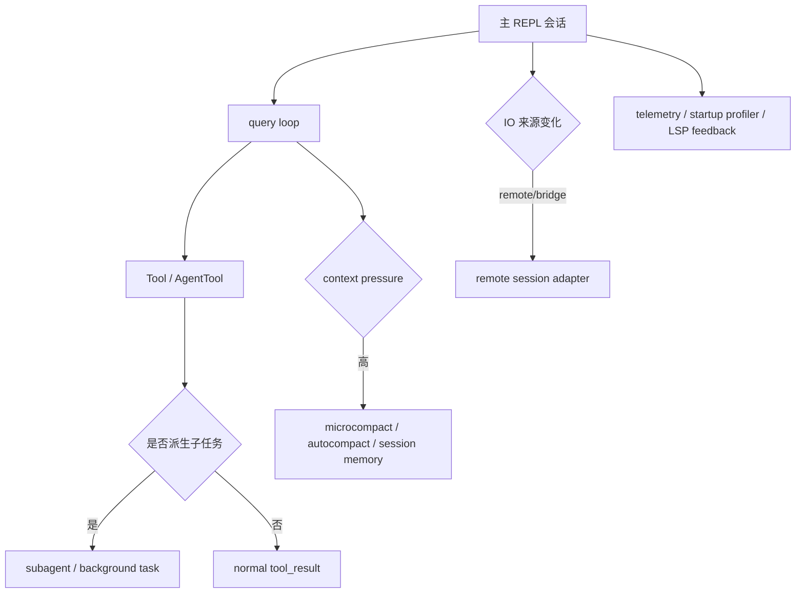

# 第 14 章：高级系统：远程、子 Agent、压缩、性能与工程化源码导读

## 本章定位

第 14 章是专题收束，不强行串成单一路径。前 13 章已经建立主链路，本章看大型 AI CLI 如何支撑真实产品复杂度：远程会话、bridge、子 Agent、background tasks、compact/session memory、LSP feedback、telemetry、startup profiler。

## 面向高级前端工程师的学习价值

这章的重点不是背模块，而是训练大型源码取舍意识：主链路之外的系统如何接入 AppState、Message、query、Tool、permission，而不破坏核心循环。

## 学习目标

1. 建立高级系统索引，知道每类能力的源码入口。
2. 解释 remote/bridge 如何改变 REPL 输入输出路径。
3. 追踪 AgentTool 如何从工具调用扩展到子 Agent/background task。
4. 说明 compact/microcompact/session memory 如何服务长上下文。
5. 找到 LSP、telemetry、startup profiler 的工程位置。
6. 在 learning-framework 中复刻 background task、compact、startup profiler。

## 前置知识

已理解第 1-13 章主线。本章不展开每个高级系统全部细节，只给源码导读入口和验证路径。

## 核心概念讲解

### 1. remote/bridge 为什么存在

```bash
rg -n "RemoteSessionManager|sendUserMessage|interrupt|connect|remotePermissionBridge|replBridge" claudecode-project/src/remote claudecode-project/src/bridge claudecode-project/src/screens/REPL.tsx -g '*.{ts,tsx}'
```

远程能力让本地 REPL 不一定直接跑 query；输入、权限、消息、状态可能跨进程/网络传递。

### 2. AgentTool 为什么是高级工具

```bash
rg -n "AgentTool|runAgent|createSubagentContext|run_in_background|LocalAgentTask|background" claudecode-project/src/tools/AgentTool claudecode-project/src/tasks -g '*.{ts,tsx}'
```

AgentTool 不是普通工具，它能启动子 Agent、创建独立上下文、产生进度消息、后台运行。

### 3. compact 是长上下文生命线

```bash
rg -n "autocompact|microcompact|sessionMemory|compact_boundary|buildPostCompactMessages" claudecode-project/src/query.ts claudecode-project/src/services/compact claudecode-project/src/utils/messages.ts
```

长会话不是无限数组，而是通过 compact boundary、summary、microcompact、session memory 维持可继续性。

### 4. LSP feedback 是异步环境输入

```bash
rg -n "registerLSPNotificationHandlers|registerPendingLSPDiagnostic|checkForLSPDiagnostics|getLSPDiagnosticAttachments" claudecode-project/src/services/lsp -g '*.{ts,tsx}'
```

LSP 不是用户主动输入，而是编辑器/语言服务器异步反馈，最终进入 Claude 可消费的诊断附件。

### 5. startup profiler 解释启动性能

```bash
rg -n "profileCheckpoint|profileReport|profiler_initialized|startupProfiler" claudecode-project/src/utils/startupProfiler.ts claudecode-project/src -g '*.{ts,tsx}' | head -80
```

大型 CLI 需要知道启动耗时在哪里，尤其是 top-level imports、init、MCP/plugin loading 这类冷启动路径。

## 核心源码地图

| 专题 | 重点源码 | 看什么 | 不看什么 |
| --- | --- | --- | --- |
| remote | `src/remote/RemoteSessionManager.ts`、`src/remote/sdkMessageAdapter.ts` | WS/HTTP 输入输出、SDK message adapter | 认证协议全量 |
| bridge | `src/bridge/*` | REPL bridge/inbound/poll | 产品端协议细节 |
| AgentTool | `src/tools/AgentTool/*`、`src/tasks/*` | 子 Agent、background task | 每种 agent UI |
| compact | `src/services/compact/*`、`src/query.ts` | auto/micro/session memory | summarization prompt 全量 |
| LSP | `src/services/lsp/*` | diagnostic registry 和 passive feedback | LSP 协议全文 |
| telemetry | `logEvent` 调用点 | 关键事件位置 | 数据平台细节 |
| startup | `src/utils/startupProfiler.ts` | checkpoint/report | profilerBase 细节 |

## 主调用链 / 主数据流

### remote 路径

```text
REPL remote mode
  -> RemoteSessionManager
  -> WebSocket events / HTTP user message
  -> sdkMessageAdapter
  -> internal Message / PermissionRequest
```

### AgentTool 路径

```text
query tool_use Agent
  -> AgentTool.call
  -> runAgent / createSubagentContext
  -> LocalAgentTask or foreground run
  -> progress messages
  -> tool_result summary
```

### compact 路径

```text
queryLoop
  -> token budget / microcompact / autocompact
  -> buildPostCompactMessages
  -> compact boundary message
  -> continue query with summarized context
```

## 源码阅读路线

```bash
rg -n "class RemoteSessionManager|sendUserMessage|sendInterrupt|sdkMessageAdapter" claudecode-project/src/remote -g '*.{ts,tsx}'
rg -n "AgentTool|runAgent|createSubagentContext|run_in_background" claudecode-project/src/tools/AgentTool -g '*.{ts,tsx}'
rg -n "LocalAgentTask|TaskState|updateTaskState|backgrounded" claudecode-project/src/tasks -g '*.{ts,tsx}'
rg -n "microcompactMessages|autoCompact|sessionMemory|buildPostCompactMessages" claudecode-project/src/services/compact claudecode-project/src/query.ts
rg -n "registerPendingLSPDiagnostic|checkForLSPDiagnostics" claudecode-project/src/services/lsp -g '*.{ts,tsx}'
rg -n "profileCheckpoint|profileReport" claudecode-project/src/utils/startupProfiler.ts
```

## 5 分钟源码速验

```bash
rg -n "RemoteSessionManager" claudecode-project/src/remote
rg -n "AgentTool|run_in_background" claudecode-project/src/tools/AgentTool -g '*.{ts,tsx}'
rg -n "microcompact|autocompact|compact_boundary" claudecode-project/src/query.ts claudecode-project/src/services/compact -g '*.{ts,tsx}'
rg -n "LSPDiagnosticRegistry|passiveFeedback" claudecode-project/src/services/lsp -g '*.{ts,tsx}'
rg -n "profileCheckpoint|profileReport" claudecode-project/src/utils/startupProfiler.ts
```

## 关键模块逐段导读

本章按专题读：

1. remote/bridge：改变输入输出位置，但仍要转回 internal messages 和 permission flow。
2. AgentTool/tasks：把工具调用扩展成可持续任务，进度通过 messages/task state 回流。
3. compact：保护 query loop 在长上下文下继续运行。
4. LSP：异步诊断进入附件/上下文。
5. startup profiler：用 checkpoint 管理冷启动可观测性。

## 与前后章节的关系

本章回收前面所有概念：REPL 提供入口，AppState 保存运行时状态，Message 承载事件，query loop 调度，Tool/permission 保证执行边界，commands/MCP/plugins 提供扩展入口。

## 深度补强：高级系统都在解决“长时间运行”的问题

第 14 章的专题看似分散：remote、bridge、AgentTool、background tasks、compact、session memory、LSP、telemetry。它们共同解决的是同一个产品现实：Claude Code 不是一次性脚本，而是长时间运行的 Agent runtime。

| 高级系统 | 解决的长运行问题 | 和主链路的关系 |
| --- | --- | --- |
| remote / bridge | 输入输出不一定来自本地终端 | 改变 REPL 的 IO 边界 |
| AgentTool / subagent | 一个工具调用可能派生独立任务 | 把 Tool 扩展成多 Agent 调度 |
| background tasks | 前台 query 可能让位给后台继续执行 | 需要 session handoff 和通知 |
| compact / microcompact | messages 不能无限增长 | query 前后持续维护上下文窗口 |
| session memory | 长任务要保留跨压缩的操作要点 | post-sampling hook + forked agent |
| LSP passive feedback | 外部诊断会影响后续行动 | 把编辑器状态注入 Agent 判断 |
| telemetry/profiling | 长链路性能和错误要可观测 | 每个边界打点和归因 |



设计取舍：

1. **子 Agent 要隔离上下文和权限**：否则一个工具调用可能污染主会话 messages、readFileState 或 permission state。
2. **compact 是 query 的核心能力，不是外围清理任务**：上下文窗口决定下一次 API 能否成功，必须在 query loop 内处理。
3. **remote/bridge 改的是 IO，不应该重写 Agent loop**：远程会话仍应复用 query/tool/message 协议，否则行为会分叉。
4. **telemetry 是理解系统的源码线索**：复杂 runtime 里，logEvent/checkpoint 往往暴露作者认为重要的边界。

这一章读法要从“专题列表”升级为“主链路变体”：

```text
本地 REPL 主链路
  -> remote 改 IO
  -> AgentTool 改 tool 执行形态
  -> compact/session memory 改上下文生命周期
  -> telemetry/LSP 改观测和反馈输入
```

## 教学可视化表达方式

```text
main chain
 入口 -> REPL -> AppState -> Message -> query -> Tool -> permission

advanced systems
 remote / bridge / AgentTool / compact / LSP / profiler
  -> all plug into main chain
```

```text
AgentTool as tool
  -> subagent runtime
  -> task state
  -> progress messages
  -> result summary
```

```text
long context
  -> token pressure
  -> compact
  -> boundary
  -> continue
```

## 实践任务

1. 为 remote、AgentTool、compact、LSP、startup profiler 各记录 2 个入口文件和 2 个关键符号。
2. 追踪 AgentTool 从 tool_use 到 background task 的调用链。
3. 追踪 query 中 compact 触发后 messages 如何变化。
4. learning-framework 实现 background task registry、compact summary、startup checkpoint。
5. 进阶分析：为什么这些高级系统不应该挤进 REPL 单文件里完成？

## 常见误区

1. 把高级系统看成边角功能。它们是产品级 AI CLI 的复杂度来源。
2. 试图把 remote/bridge 当普通 WebSocket。它还要处理 messages、permission、interrupt。
3. 把 AgentTool 当普通工具。它创建新的执行上下文。
4. 把 compact 当清空历史。它是上下文连续性机制。

## 本章总结

第 14 章的模型：

```text
高级系统不是新主线，而是主链路的扩展面
```

证据链：

```text
remote/bridge -> message adapter/permission bridge
AgentTool -> task/subagent
compact -> query continuation
LSP -> async diagnostics
profiler -> startup checkpoints
```

## 下一步

进入三轮整体检查：结构完整性、源码证据链、课程一致性。最终输出课程总目录、附录索引和验收报告。
